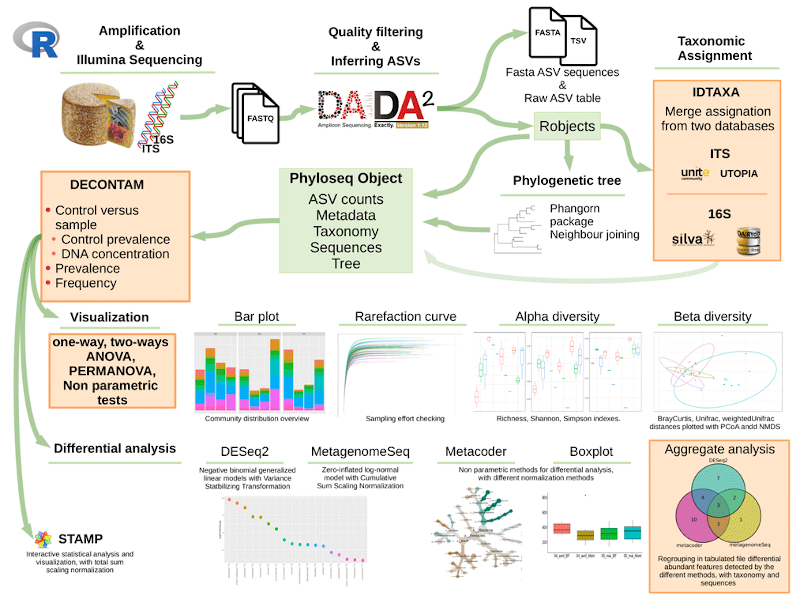

<!-- README.md is generated from README.Rmd. Please edit that file -->

# rANOMALY <a href="https://forgemia.inra.fr/umrf/ranomaly/"></a>

---

- [Installation](#installation)
    - [Linux](#linux-highly-recommended)
    - [Windows](#windows)
- [Documentation and Tutorials](#documentation-and-tutorials)
- [Ressources / reference DBs](#ressources)
- [Citation](#citation)

---
<!-- badges: start -->

<!-- [](https://www.tidyverse.org/lifecycle/#experimental) -->

<!-- badges: end -->

rANOMALY is an R Package integrating AmplicoN wOrkflow for Microbial community AnaLYsis. [Here the
F1000 reference paper](https://f1000research.com/articles/10-7) and [the
poster](https://hal.archives-ouvertes.fr/hal-02340484/) presenting this workflow.

 


A shiny app [ExploreMetabar](https://explore-metabar.sk8.inrae.fr/) is available to explore phyloseq object generated with rANOMALY or other tools, and allow users to perform statistical analysis in an user friendly interface (no command line).

## Installation

You can install rANOMALY from this repository with following commands (tested on R 4.4.2):

### Linux (highly recommended)

In bash terminal:

```bash
sudo apt-get install -y git libcurl4-openssl-dev libssl-dev libxml2-dev libgmp3-dev libmpfr-dev cmake zlib1g-dev libglpk40 libglpk-dev liblzma-dev libbz2-dev libfontconfig1-dev libfribidi-dev libharfbuzz-dev libfreetype6-dev libpng-dev libtiff5-dev libjpeg-dev pandoc
```

* **pygit2**: https://www.pygit2.org/install.html#quick-install

* **cutadapt**: rANOMALY allow the use of CUTADAPT to search and trim primers from raw sequences. You can find the simple installation step [here](https://cutadapt.readthedocs.io/en/stable/installation.html).

* **pandoc**: https://github.com/jgm/pandoc/releases/tag/2.10.1

Then, R console: 

``` r
install.packages("renv", "BiocManager")
options(renv.config.gitlab.host = "https://forgemia.inra.fr", repos = BiocManager::repositories())

renv::install("gitlab::umrf/ranomaly@master")
```


### Windows

Require: 

- [Rtools](https://cran.r-project.org/bin/windows/Rtools/)

- [git](https://git-scm.com/download/win)


Then, R console: 

``` r
install.packages("renv")
options(renv.config.gitlab.host = "https://forge.inrae.fr", repos = BiocManager::repositories())

renv::install("gitlab::umrf/ranomaly@master")
```


## Documentation and Tutorials

Visit [the rANOMALY
page](https://umrf.pages.mia.inra.fr/ranomaly/index.html)

## Ressources

IDTAXA formatted references databases for 16S and ITS are [available
here](https://nextcloud.inrae.fr/s/YHi3fmDdEJt5cqR).

## Citation

Sebastien Theil and Etienne Rifa. « RANOMALY: AmplicoN WOrkflow for Microbial Community AnaLYsis ». F1000Research 10 (07/01/2021): 7. https://doi.org/10.12688/f1000research.27268.1.

If you use rANOMALY, please cite following tools:

Callahan, Benjamin J., Paul J. McMurdie, Michael J. Rosen, Andrew W. Han, Amy Jo A. Johnson, et Susan P. Holmes. « DADA2: High-Resolution Sample Inference from Illumina Amplicon Data ». Nature Methods 13, nᵒ 7 (juillet 2016): 581‑83. https://doi.org/10.1038/nmeth.3869.

McMurdie, Paul J., et Susan Holmes. « Phyloseq: An R Package for Reproducible Interactive Analysis and Graphics of Microbiome Census Data ». PLOS ONE 8, nᵒ 4 (22 avril 2013): e61217. https://doi.org/10.1371/journal.pone.0061217.

Murali, Adithya, Aniruddha Bhargava, et Erik S. Wright. « IDTAXA: a novel approach for accurate taxonomic classification of microbiome sequences ». Microbiome 6, nᵒ 1 (9 août 2018): 140. https://doi.org/10.1186/s40168-018-0521-5.

## Licence

  [ETALAB](https://www.etalab.gouv.fr/wp-content/uploads/2018/11/open-licence.pdf)
GPL 3.0

## Copyright
2025 INRAE
