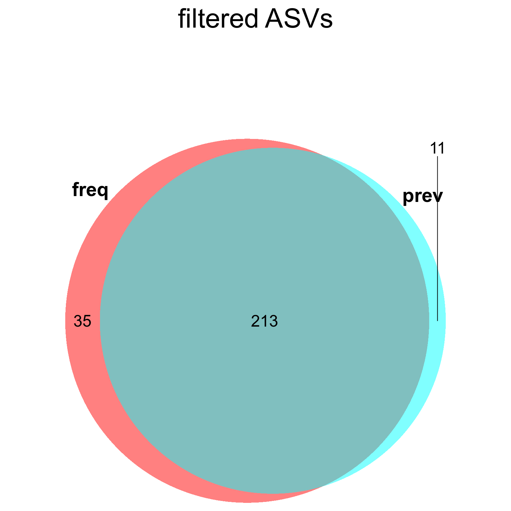
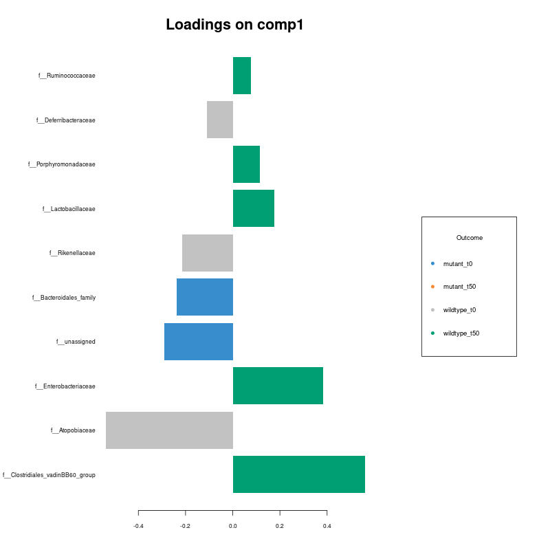
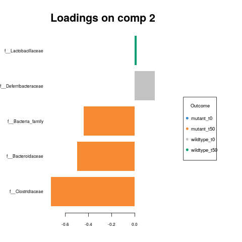
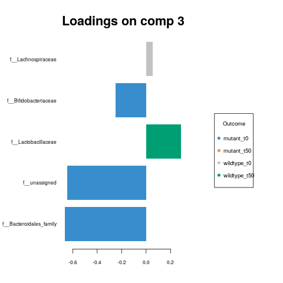
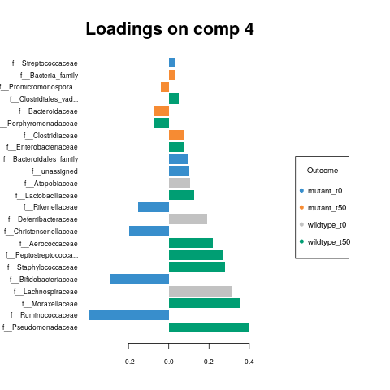
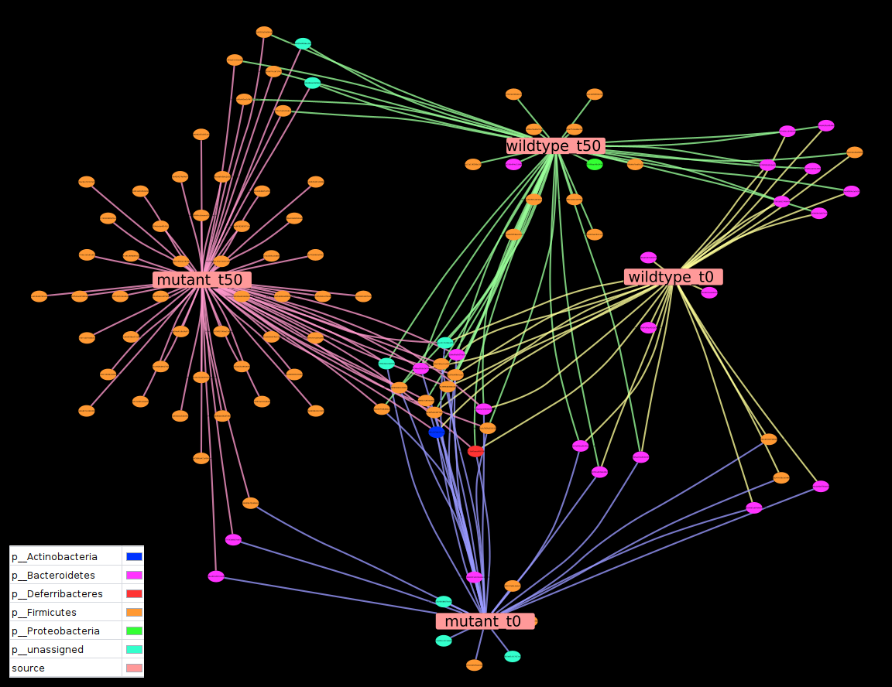

```{r loading_libraries, warning = FALSE, message=FALSE, include=FALSE, results='hide'}
library(DT)
library(pander)
devtools::load_all(".")
```
We share this use case to show all features of `rANOMALY` package that allow to highlight microbial community differences between groups of samples. `rANOMALY` main features are :

* ASV (Amplpicon Sequence Variant) computation thanks to `dada2` algorithm

* Taxonomic assignment thanks to `IDTAXA` from `DECIPHER` package. `rANOMALY` allow to assign with up to 2 complementary reference databases (eg. SILVA which is generalist, DAIRYdb which is specific to dairy environments), keep the best and more confident taxonomic assignment, check for taxonomy incongruencies like empty fields or multiple ancestors.

* `phyloseq` format to handle data and downstream statistical analysis.

* Decontamination step thanks to `decontam` package. `rANOMALY` allows to filter ASV depending on ASV overall frequency (low abundance filter), and ASV prevalence (presence in 1 or more samples), specific filters like manual suppression of specific taxa are available to.

* Complete statistical analysis workflow: rarefaction curves, community composition plots, alpha/beta diversity analysis with associated statistical tests and multivariate analysis ; differential analysis using four different methods (`metacoder`, `DESeq2`, `metagenomeSeq`, `plsda`).

* At each step, plots and R objects are returned in command line AND saved in folders to be able to relaunch the analysis and to export plots.


# Help

Each function has a detailed help accessible in R via `?{function}`.

# Tests datasets

The dataset can be downloaded via this [link](https://nextcloud.inrae.fr/s/Zx3iASe64x8oSoM).

This tutorial assumes that you have extracted all the read file in a folder named `reads` along with the `sample-metadata.csv` file.

We share a 24 DNA samples test dataset extracted from rats feces at two different time (t0 & t50) and in two nutrition conditions. Rats were fed with two strains of some bacteria (wild type & mutant). Also, extraction control sample (blank) are included.

```{r loading_metadata, warning = FALSE, message = TRUE}
sm <- read.table("sample_metadata.csv", sep="\t",header=TRUE)
DT::datatable(sm)
```

```{r}
load("decontam_out/robjects.Rdata")
```

# Processing of raw sequences

## ASV definition with DADA2

The first step is the creation of ASVs thanks to the `dada2` package.
In `rANOMALY`, only one function is needed to compute all the different steps require from this package. The function is designed to process Illumina paired end sequences in fastq format.

Sample names are extracted from the file name, from the beginning to the first underscore (_), so files must be formatted as followed :
{sample-id1}_R1.fastq.gz
{sample-id1}_R2.fastq.gz
etc...
Those must match the sample names stored in `sample-metadata.csv` file.

```{r eval=FALSE}
dada_res = dada2_fun(path="./reads", compress=TRUE)
```

Main outputs:

* `./dada2_out/read_tracking.csv` summarizes the read number after each filtering step.

* `./dada2_out/raw_otu-table.csv` the raw ASV table.

* `./dada2_out/rep-seqs.fna`: fasta file with all representative sequences for each ASV.

* `./dada2_out/robjects.Rdata` with saved `dada_res` list containing raw ASV table and representative sequences in objects `otu.table`, `seqtab.export` & `seqtab.nochim`.


Read tracking table:

* *input*: raw read number.

* *filtered*: after dada2 filtering step: no N's in sequence, low quality, and phiX.

* *denoisedF* & *denoisedR*: after denoising. Forward & Reverse.

* *merged*: after merging R1 & R2.

* *nonchim*: after chimeras filtering.

```{r}
DT::datatable(read.table("dada2_out/read_tracking.csv",sep="\t",header=TRUE), filter = "top")
```

## Taxonomic assignment

`assign_taxo_fun` function uses IDTAXA function from DECIPHER package, and allows to use 2 different databases. It keeps the best assignment on 2 criteria, resolution (depth in taxonomy assignment) and confidence. The final taxonomy is validated for multiple ancestors and incongruities correction step.

We share the latest databases we use in the IDTAXA format in this [link](https://nextcloud.inrae.fr/s/YHi3fmDdEJt5cqR). You can also generate your own IDTAXA formatted database following those instructions and scripts we provide at  [this page](https://forgemia.inra.fr/umrf/ranomaly/-/wikis/idtaxa_db_proc).


```{r eval=FALSE}
tax.table = assign_taxo_fun(dada_res = dada_res, id_db = c("path_to_your_banks/silva/SILVA_SSU_r132_March2018.RData","path_to_your_banks/DAIRYdb_v1.2.0_20190222_IDTAXA.RData") )
```

```{r echo=FALSE}
DT::datatable(tax_table(data), filter = "top", options = list(scrollX = TRUE))
```


Main file outputs:

- `./idtaxa/robjects.Rdata` with taxonomy in phyloseq format in `tax.table` object.

- `final_tax_table.csv` the final assignation table that will be use in next steps.

- `allDB_tax_table.csv` raw assignations from the two databases, mainly for debugging.

## Phylogenetic Tree

The phylogenetic tree from the representative sequences is generated using `phangorn` and `DECIPHER` packages.

```{r eval=FALSE}
tree = generate_tree_fun(dada_res)
```

Main outputs:
- `tree_robjects.Rdata` with phylogenetic `tree` object in phyloseq format.

## Phyloseq object

To create a [phyloseq](https://joey711.github.io/phyloseq/) object, we need to merge four objects and one file:

- the asv table `dada_res` and  the representative sequences `seqtab.nochim` from `dada2_robjects.Rdata`

- a taxonomy table (`taxtable`) `taxo_robjects.Rdata` from `taxo_robjects.Rdata`

- the phylogenetic tree `tree` from `tree_robjects.Rdata`

- `metadata` from `sample-metadata.csv`

```{r eval = FALSE}
data = generate_phyloseq_fun(dada_res = dada_res, tax.table = tax.table, tree = tree, metadata = "./sample_metadata.csv")
```


Main output:

* `./phyloseq/robjects.Rdata` with phyloseq object in `data` for raw counts and `data_rel` for relative abundance.

## Decontamination

The `decontam_fun` function uses [decontam](https://www.bioconductor.org/packages/release/bioc/html/decontam.html) R package with control samples to filter contaminants.
The `decontam` package offers two main methods, frequency and prevalence (and then you can combine those methods). For frequency method, it is mandatory to have the DNA concentration of each sample in phyloseq (and hence in the `sample-metadata.csv`). The prevalence method does not need DNA quantification, this method allows to compare presence/absence of ASV between real samples and control samples and then identify contaminants.

**Tips**: sequencing plateforms often quantify the DNA before sequencing, but do not automaticaly give the information. Just ask for it ;).

Our function integrates the basic ASV frequency (nb_reads_ASV/nb_total_reads) and overall prevalence (nb_sample_ASV/nb_total_sample) filtering. We included an option to filter out ASV based on their taxa names (for known recurrent contaminants).

```{r eval=FALSE}
data = decontam_fun(data = data, domain = "Bacteria", column = "type", ctrl_identifier = "control", spl_identifier = "sample", number = 100, krona= TRUE)
```

```{r}
data
```


Main outputs:
- `robjects.Rdata` with contaminant filtered phyloseq object named `data`.
- `Exclu_out.csv`  list of filtered ASVs for each filtering step.
- Krona plot before and after filtering.
- `raw_asv-table.csv` & `relative_asv-table.csv`.
- `venndiag_filtering.png`.



# Plots, diversity and statistics

We are currently developping a ShinyApp to visualize your data, sub-select your samples/taxons and do all those analyses interactively !!!
[ExploreMetabar](https://erifa1.shinyapps.io/exploremetabar/)

## Rarefaction curves

In order to observe the sampling depth of each samples we start by plotting rarefactions curves. Those plots are generated by `plotly` which makes the plot interactive.

```{r rareproc, warning = FALSE, results='hide'}
rareplot = rarefaction(data, "strain_time", 100 )
```
```{r rareplot}
htmltools::tagList(list(rareplot))
```

## Composition plots

The `bar_fun` function outputs a composition plot, in this example it reveals the top 10 genus present in our samples. The function allows to plot at different `rank` and to modify the number of taxas to show.

- `Ord1` option order the sample along the X axis.

- `Fact1` option control labels of the X axis. `Fact1="sample.id"` if you don't want the sample to be renamed.

### Raw abundance
```{r compo_raw, fig.width=10, warning=FALSE, message=FALSE}
bars_fun(data = data, top = 10, Ord1 = "strain_time", rank="Genus", relative = FALSE, split = TRUE, verbose = FALSE)
```

### Relative abundance
```{r compo_relative, fig.width=10, message=FALSE, warning=FALSE}
bars_fun(data = data, top = 10, Ord1 = "strain_time", rank="Genus", relative = TRUE, split = TRUE, verbose = FALSE)
```


## Diversity analyses

### Alpha diversity

This function computes various alpha diversity indexes, it uses the [`estimate_richness`](https://www.rdocumentation.org/packages/phyloseq/versions/1.16.2/topics/estimate_richness) function from `phyloseq`. 

Available measures : c("Observed", "Chao1", "ACE", "Shannon", "Simpson", "InvSimpson", "Fisher").

It returns a list which contains:

- a boxplot comparing conditions. (`$plot`)

- a table of indices values.  (`$alphatable`)

And for each of the computed indices :

- an ANOVA analysis. (`${measure}$anova`)

- a pairwise wilcox test result comparing conditions and giving the pvalue of each comparison tested. (`${measure}$wilcox_col1`, `${measure}$wilcox_col2_fdr`, `${measure}$wilcox_col2_collapsed`)

- a mixture model if your data include repetition in sampling, ie. `column3` option. (`${measure}$anovarepeat`, `${measure}$mixedeffect`)


All this in a single function.

```{r alpha, warning=FALSE, message=FALSE, results = 'hide'}
alpha <- diversity_alpha_fun(data = data, output = "./plot_div_alpha/", column1 = "strain", column2 = "time", column3 = "", supcovs = "", measures = c("Observed", "Shannon") )
```

### Table of diversity index values
The table of values for each indices you choose to compute.
```{r alpha_tables}
pander(alpha$alphatable, style='rmarkdown')
```
### Boxplots

The boxplots of those values.

```{r alpha_boxplots, warnings = FALSE, message=FALSE, echo = TRUE}
alpha$plot

```

### Tests on Observed index

#### ANOVA results

For each indices, you have access to the ANOVA test. Here we present the result for the "Observed" indice.

```{r}
pander(alpha$Observed$anova)
```

#### Wilcox test

Wilcox tests are made on each factor you have entered, and the combination of the two. Here "strain" and "time".

#### Wilcox test for "strain" factor
```{r}
pander(alpha$Observed$wilcox_col1)
```
#### Wilcox test for "time" factor
```{r}
pander(alpha$Observed$wilcox_col2_fdr)
```
#### Wilcox test for the collapsed factors
```{r}
pander(alpha$Observed$wilcox_col2_collapsed)
```


## Beta diversity


The `diversity_beta_light` function is equivalent to the first function but allows to generate specific tests and figures ready to publish in rmarkdown as in the example below. It is based on the vegan package function [`vegdist`](https://www.rdocumentation.org/packages/vegan/versions/2.4-2/topics/vegdist) for the distance calculation and [`ordinate`](https://www.rdocumentation.org/packages/phyloseq/versions/1.16.2/topics/ordinate) for the ordination plot.

We include statistical tests to ease the interpretation of your results. A permutational ANOVA to compare groups and test that centroids and dispersion of the groups are equivalent for all groups. User can inform `col` and `cov` arguments to assess PERMANOVA to determine significant differences between groups (eg. factor "strain" here and covariable "time"). A pairwise-PERMANOVA is processed to determine which condition is significantly different from another (based on p-value).

As return, you will get an object that contains:

- An ordination plot (`$plot`)

- The permANOVA results (`$permanova`)

- The pairwise permANOVA (`$pairwisepermanova`)

```{r beta0, warning=FALSE, results = 'hide', echo = FALSE, eval = FALSE}
# beta <- diversity_beta_light(data = data, output = "./plot_div_beta/", glom = "ASV", column1 = "time", column2 = "strain", covar ="")
beta_strain = diversity_beta_light(data, col = "strain", cov="time", dist0 = "bray", ord0 = "MDS", output="./plot_div_beta_strain/", tests = TRUE)
beta_time = diversity_beta_light(data, col = "time", cov="strain", dist0 = "bray", ord0 = "MDS", output="./plot_div_beta_time/", tests = TRUE)
# ggplotly(beta_strain$plot), ggplotly(beta_time$plot), 
```


```{r beta, warning=FALSE, results = 'hide'}
beta_strain_time = diversity_beta_light(data, col = "strain_time", dist0 = "bray", ord0 = "MDS", output="./plot_div_beta_strain_time/", tests = TRUE)
```

### Ordination plot


```{r beta_ordination, warning=FALSE}
htmltools::tagList(list(ggplotly(beta_strain_time$plot)))
```


### Statistical tests

* permanova

```{r beta_test1, warning=FALSE}
pander(beta_strain$permanova)
```

* pairwise permanova on concatenated factors

```{r beta_test2, warning=FALSE}
pander(beta_strain_time$pairwisepermanova)
```


## Differential analyses

We choose three different methods to process differential analysis which is a key step of the workflow. The main advantage of the use of multiple methods is to cross validate differentially abundant taxa between tested conditions.

### Metacoder

Metacoder is the most simple differential analysis tool of the three. Counts are normalized by total sum scaling to minimize the sample sequencing depth effect and it uses a Kruskal-Wallis test to determine significant differences between sample groups. The `metacoder_fun` function allows the user to choose the **taxonomic `rank`**, which factor to the test (`column1`), and a specific pairwise comparison (`comp`) to launch the differential analysis.

It also produces pretty graphical trees, representing taxas present in both groups and coloring branches depending on the group in which this taxa is more abundant. Two of those trees are produced, the raw one and the non significant features filtered one (p-value <= 0.05).

```{r,warning = FALSE, message = FALSE,  fig.keep='all', fig.align='left', fig.width = 15, fig.height = 10, echo = TRUE, results = 'hide'}
out1 = metacoder_fun(data = data, output = "./metacoder", column1 = "strain_time", rank = "Family", signif = TRUE, plottrees = TRUE, min ="10", comp = "wildtype_t50~mutant_t50,wildtype_t0~mutant_t0")

```

- Table
```{r,warning = FALSE, message = TRUE,  fig.keep='all', fig.align='left', fig.width = 15, fig.height = 10, echo = TRUE}
 DT::datatable(out1$table, filter = "top", options = list(scrollX = TRUE))
```

- Comparaison 1
```{r,warning = FALSE, message = TRUE,  fig.keep='all', fig.align='left', fig.width = 15, fig.height = 10, echo = TRUE}
 out1$wildtype_t0_vs_mutant_t0$signif
```

- Comparaison 2
```{r,warning = FALSE, message = TRUE,  fig.keep='all', fig.align='left', fig.width = 15, fig.height = 10, echo = TRUE}
 out1$wildtype_t50_vs_mutant_t50$signif
```


### DESeq2

DESeq2 is a widely used method, primarily for RNAseq applications, for assessing differentially expressed genes between controlled conditions. It use for metabarcoding datas is sensibly the same. The `deseq2_fun` allows to process differential analysis as `metacoder_fun`, and users can choose the taxonomic rank, factor to test and which conditions to compare. DESeq2 algorithm uses negative binomial generalized linear models with VST normalization (Variance Stabilizing Transformation).

Main output is a list with :

* list${comparison}$plot: plot with significant features
* list${comparison}$table: table with statistics (LogFoldChange, pvalue, adjusted pvalue...)

```{r,warning = FALSE, message = FALSE, echo = TRUE, fig.width = 15, results = 'hide'}
#fig.keep='all', fig.align='left', fig.width = 15, fig.height = 10
out2 = deseq2_fun(data = data, output = "./deseq/", column1 = "strain_time", verbose = 1, rank = "Family", comp = "wildtype_t50~mutant_t50,wildtype_t0~mutant_t0")
```

```{r,warning = FALSE, message = FALSE, echo = TRUE, fig.width = 10}
ggplotly(out2$wildtype_t50_vs_mutant_t50$plot)
DT::datatable(out2$wildtype_t50_vs_mutant_t50$table, filter = "top", options = list(scrollX = TRUE))
```

### MetagenomeSeq

MetagenomeSeq uses a normalization method able to control for biases in measurements across taxonomic features and a mixture model that implements a zero-inflated Gaussian distribution to account for varying depths of coverage. As `deseq2_fun`, `metagenomeseq_fun` returns a table with statistics and a plot with significant features for each comparison.


```{r,warning = FALSE, message = TRUE,  fig.keep='all', fig.align='left', echo = TRUE, results = "hide"}
out3 = metagenomeseq_fun(data = data, output = "./metagenomeseq/", column1 = "strain_time", verbose = 1, rank = "Family", comp = "wildtype_t50~mutant_t50,wildtype_t0~mutant_t0")
```

```{r,warning = FALSE, message = TRUE,  fig.keep='all', fig.align='left', echo = TRUE}
ggplotly(out3$wildtype_t50_vs_mutant_t50$plot)

DT::datatable(out3$wildtype_t50_vs_mutant_t50$table, filter = "top", options = list(scrollX = TRUE))
```

### Aggregate methods

The `aggregate_fun` function allows to merge the results from the three differential analysis methods used before, to obtain one unique table with all informations of significant differentially abundant features.

The generated table include the following informations :

* seqid: ASV ID

* Comparaison: Tested comparison

* Deseq: differentially abundant with this method (0 no or 1 yes)

* metagenomeSeq: differentially abundant with this method (0 no or 1 yes)

* metacoder: differentialy abundant with this method (0 no or 1 yes)

* sumMethods: sum of methods in which feature is significant.

* DESeqLFC: Log Fold Change value as calculated in DESeq2

* absDESeqLFC: absolute value of Log Fold Change value as calculated in DESeq2

* MeanRelAbcond1: Mean relative abundance in condition 1

* MeanRelAbcond2: Mean relative abundance in condition 2

* Condition: in which the mean feature abundance is higher.

* Taxonomy & representative sequence.


```{r,warning = FALSE, message = TRUE,  fig.keep='all', fig.align='left', fig.height = 10, echo = TRUE, results = "hide"}
resF = aggregate_fun(data = data, metacoder = "./metacoder/metacoder_signif_Family.csv", deseq = "./deseq/", mgseq = "./metagenomeseq/", output = "./aggregate_diff/", column1 = "strain_time", column2 = NULL, verbose = 1, rank = "Genus", comp = "wildtype_t50~mutant_t50,wildtype_t0~mutant_t0")
```

```{r,warning = FALSE, message = TRUE,  fig.keep='all', fig.align='left'}
ggplotly(resF$wildtype_t0_vs_mutant_t0$plot)

ggplotly(resF$wildtype_t50_vs_mutant_t50$plot)

DT::datatable(resF$table, filter = "top", options = list(scrollX = TRUE))
```


### PLSDA (Partial Least Squares Discriminant Analysis)

Our PLS-DA/sparse PLS-DA analysis is based on the [mixOmics package](http://mixomics.org/methods/pls-da/). These are supervised classification methods. They allow to define most important features discriminating our groups. The `plsda_res` function outputs a list of graphs and tables:

- `plsda$plotIndiv` ordination plot from the PLSDA analysis.

- `splsda$plotIndiv` ordination plot from the sparse PLSDA analysis.

- `loadings$comp{n}` all the loadings plots for each component from the sPLSDA analysis. Loadings weights are displayed and colors correspond to the group in which each feature has its maximum mean value.  

- `splda.loading_table` Loading of all taxas for each component.

- `splsda$plotArrow` arrow plot of samples.


```{r pslda, results = 'hide', warning = FALSE, message = FALSE}
plsda_res <- plsda_fun(data = data, output = "./plsda_family/", column1 = "strain_time", rank = "Family")
```

```{r splsda.plotIndiv}
plsda_res$splsda.plotIndiv$graph
```


```{r plsda.loadings, fig.align='center'}

```

```{r plsda.loadings2, fig.align='center'}

```

```{r plsda.loadings3, fig.align='center'}

```

```{r plsda.loadings4, fig.align='center'}

```

# Miscellaneous function

## Heatmap

`heatmap_fun` allows to plot relative abundance of the top abundant taxas (20 by default). Users can choose which taxonomic rank to plot and the factor used to separate plots.

```{r heatmap, fig.align='center', results = "hide"}
heatmap_plot = heatmap_fun(data = data, column1 = "strain_time", top = 20, output = "./plot_heatmap/", rank = "Species")
```

```{r heatmapplot, fig.align='center'}
heatmap_plot$plot
```

## Shared taxa

* Venn Diagram

`ASVenn_fun` allows to define shared taxa between specific conditions (up to 5 conditions). It generates a venn diagram and a table informing presence of each ASV in each condition with its taxonomy and sequence. Counts can be verified with this table. `rank` argument allows to generate output with desired taxonomic level.

```{r asvenn, results = "hide"}
outvenn = ASVenn_fun(data = data,output = "./ASVenn/", rank = "ASV", column1 = "strain_time", shared = TRUE)
```

* Venn diagram: 

```{r}
outvenn$venn_plot
```

* Table:

```{r}
DT::datatable(outvenn$TABf, filter = "top", options = list(scrollX = TRUE))
```

* Cytoscape
`phy2cyto_fun` allows to generate input files (SIF format) for [Cytoscape](https://cytoscape.org/) which is useful to visualize shared taxa. You can see below an example of representation with Cytoscape on our test data. Each nodes and arrows position and aesthetic can be easily modified. 




## Supplementary tools and features

`csv2phyloseq_fun` allows to import the 4 files (ASV, taxonomy, tree and sequences) in tabulated format to generate phyloseq object ready to use with `rANOMALY`.

`assign_fasta_fun` is used to assign sequences from any fasta files.

`export_to_stamp_fun` allows you to generate input files for [STAMP](https://beikolab.cs.dal.ca/software/STAMP).

`split_table_fun` allows to split the phyloseq object in multiple sub-object according to one factor (column).

`update_metadata_fun` allows you to easily modify `sample_data` part of the phyloseq object.

# R Session info

```{r}
sessionInfo()
```
